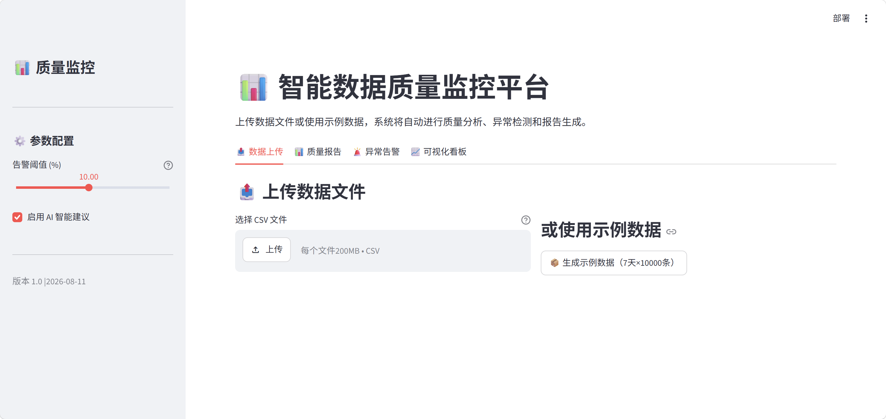
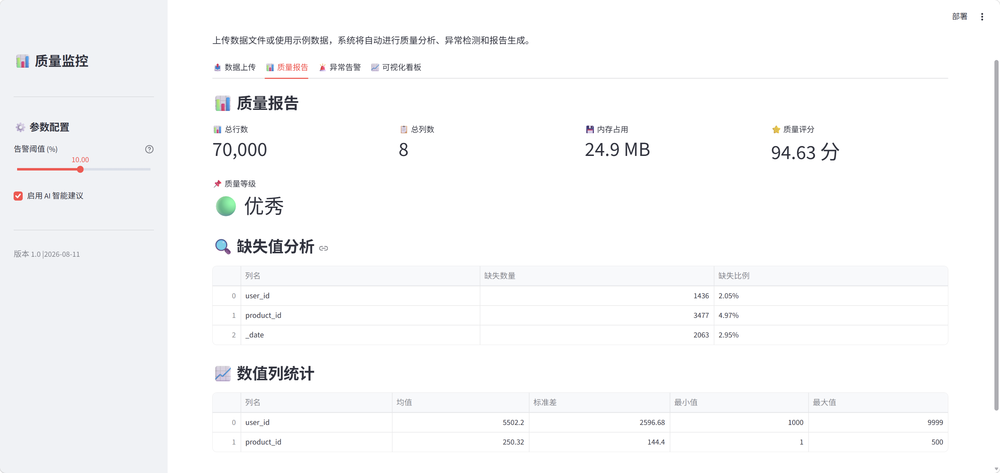
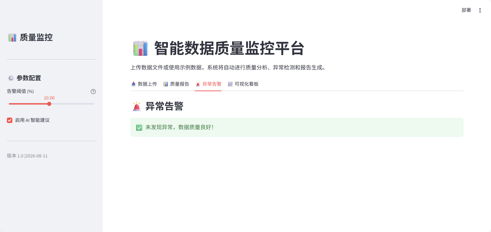

# 智能数据质量监控平台

> 一个端到端的数据质量保障系统，集成数据模拟、画像分析、异常检测、AI 智能建议、可视化报告和 Web 交互界面，帮助团队快速发现并解决数据质量问题。

[](https://www.python.org/)
[](https://streamlit.io/)
[](#)
[](LICENSE)


## 📌 项目简介
在数据驱动的业务中，**数据质量**直接影响决策的准确性。本项目构建了一个**自动化数据质量监控平台**，能够：

- 🔄 模拟生成用户行为日志（含异常注入）
- 📊 自动进行数据画像分析（21 项统计指标）
- 🚨 通过 3 种算法检测数据异常（空值率 / Z-score / 数据量突降）
- 🧠 接入大模型（DeepSeek）生成智能修复建议
- 📄 产出美观的 HTML 告警报告（含图表 + PDF 导出）
- 📈 生成可视化看板（PV/UV 趋势、事件分布、小时热力图）
- 🌐 提供 Streamlit Web 交互界面，无需代码即可使用

> **适用场景**：数据质量保障、数据治理、ETL 监控、AI + Data 工程实践


## 🛠️ 技术栈

| 类别 | 技术 |
|------|------|
| 编程语言 | Python 3.10+ |
| 数据处理 | Pandas, NumPy, PySpark |
| 数据库 | MySQL, Hive (可选) |
| AI 增强 | DeepSeek API |
| 可视化 | Matplotlib, Chart.js |
| Web 界面 | Streamlit |
| 告警报告 | HTML (自包含) |
| 单元测试 | pytest |
| 容器化 | Docker, Docker Compose |
| 环境管理 | venv, pip, python-dotenv |


## 🏗️ 项目架构

### 数据处理流程

用户行为日志（模拟生成）
↓
数据画像分析（空值率/均值/分布）
↓
异常检测（空值率/Z-score/数据量突降）
↓
AI 智能建议（DeepSeek 生成修复方案）
↓
告警推送（控制台 + HTML报告）
↓
质量报告 + 可视化看板


### Web UI 交互流程
数据上传（CSV）或生成示例数据
↓
点击「开始质量分析」
↓
自动执行：画像 → 检测 → AI → 告警 → 报告
↓
查看「质量报告」「异常告警」「可视化看板」


📸 实际运行效果
终端运行
bash
python main.py --threshold 3.0
数据画像摘要：

text
总行数: 70,000 | 总列数: 7 | 内存占用: 24.37 MB | 质量评分: 95.1/100
存在缺失值的列: 2 列
   - user_id: 1,436 (2.05%)
   - product_id: 3,477 (4.97%)
异常检测结果（阈值 3%）：

text
🔍 检测空值率异常（阈值: 3.0%）...
   ⚠️ 列 'product_id': 空值率 4.97% (超过阈值)

📊 异常检测结果汇总
发现 1 个异常项：
   1. [null_rate_anomaly] 列 'product_id' 空值率达到 4.97%，超过阈值 3.0%
      建议: 建议检查数据源，确认是否有字段缺失或采集逻辑变更
Web UI 界面






支持数据上传、参数配置、一键运行和结果可视化展示。

🚀 快速开始
方式一：本地运行
bash
# 1. 克隆项目
git clone https://github.com/Lisa-xia/user_behavior_quality_platform.git
cd user_behavior_quality_platform

# 2. 创建虚拟环境
python -m venv .venv
.venv\Scripts\activate

# 3. 安装依赖
pip install -r requirements.txt

# 4. 配置（可选）
# 编辑 .env 文件，填入 DeepSeek API Key

# 5. 运行
python main.py

# 6. 自定义参数
python main.py --days 14 --rows 20000 --threshold 5.0 --no-ai
方式二：Web UI（推荐）
bash
# 启动 Web 界面
streamlit run web/app.py
浏览器自动打开 http://localhost:8501，在网页中：

点击「生成示例数据」或上传 CSV 文件

点击「开始质量分析」

切换到「质量报告」「异常告警」「可视化看板」查看结果

📋 命令行参数
参数	说明	默认值
--days	生成数据的天数	7
--rows	每天生成的数据行数	10000
--threshold	空值率告警阈值（%）	10.0
--no-ai	禁用 AI 功能	启用
--no-viz	禁用可视化图表	启用
--output	输出目录路径	./output
--log-level	日志级别（DEBUG/INFO/WARNING/ERROR）	INFO


📊 核心功能详解
🔍 数据画像分析
自动统计数据集的基础信息：

总行数、总列数、内存占用

每列缺失值数量及比例

数值列的均值、标准差、分位数

分类列的唯一值数量

综合质量评分（0-100 分）

🚨 异常检测（3 种算法）
检测方法	说明	适用场景
空值率异常	当某列空值率超过阈值时告警	数据采集缺失、上游 ETL 失败
数据量突降	对比历史均值，下降超过 30% 时告警	数据管道中断、业务量异常波动
Z-score 异常	识别偏离均值 3 倍标准差的极端值	数据录入错误、异常值污染
🧠 AI 智能建议
调用 DeepSeek 大模型

自动分析异常根因

生成具体可执行的修复建议

📄 告警报告
控制台实时输出

日志文件记录（output/alerts.log）

美观的 HTML 报告（含 Chart.js 图表 + 一键 PDF 导出）

📈 可视化看板
每日 PV/UV 趋势图

事件类型分布堆叠图

小时级流量热力图

🌐 Web UI
数据上传（CSV 文件）

一键生成示例数据

参数可视化配置

质量报告、异常告警、趋势图表实时展示

## 📁 项目结构

```
user_behavior_quality_platform/
├── data_generator/              # 数据模拟生成
│   └── log_simulator.py
├── quality_engine/              # 核心质量引擎
│   ├── profiler.py              # 数据画像分析
│   ├── anomaly_detector.py      # 异常检测（3 种算法）
│   ├── ai_advisor.py            # AI 智能建议
│   ├── alert.py                 # 告警推送
│   ├── reporter.py              # 质量报告生成
│   ├── visualizer.py            # 可视化看板
│   └── logger.py                # 日志系统
├── tests/                       # 单元测试
│   ├── __init__.py
│   ├── test_profiler.py
│   └── test_anomaly_detector.py
├── web/                         # Web UI
│   └── app.py                   # Streamlit 应用
├── dags/                        # Airflow 调度（预留）
│   └── quality_monitor_dag.py
├── output/                      # 输出目录（自动生成）
│   ├── quality_report.md
│   ├── alert_report.html
│   └── images/
├── docs/                        # 文档截图
├── .env                         # 环境变量
├── .dockerignore
├── Dockerfile
├── docker-compose.yml
├── requirements.txt
├── main.py                      # 命令行入口
└── README.md                    # 项目说明
```

🎯 项目亮点
✅ 端到端自动化：python main.py 一键完成全流程

✅ 多维度异常检测：3 种检测算法覆盖常见数据质量问题

✅ AI + Data 融合：接入大模型生成智能修复建议

✅ 可视化输出：HTML 报告 + Chart.js 图表 + 一键 PDF 导出

✅ Web 交互界面：Streamlit 应用，非技术人员也可使用

✅ 单元测试覆盖：4 个测试用例，保障核心模块稳定性

✅ 生产级代码规范：配置文件分离、日志系统、命令行参数

✅ 容器化部署：Docker + Docker Compose 一键运行

🧪 运行测试
bash
# 运行所有单元测试
pytest tests/ -v

# 生成覆盖率报告
pytest tests/ --cov=quality_engine --cov-report=html
🔮 后续规划
□ 接入 Kafka 实时数据流，实现准实时监控
□ 使用 Airflow 实现任务定时调度（已预留 DAG）
□ 支持 Hive/Spark 大数据环境（已具备基础）
□ 增加更多异常检测算法（孤立森林、LOF）
□ 对接钉钉/企业微信告警推送
□ 搭建 Grafana 可视化看板
📌 数据来源
本项目使用模拟数据，数据生成器会注入预设比例的异常，用于演示质量检测能力。
异常注入比例：
product_id 为空：5.0%
user_id 为空：2.1%
event_time 格式错误：2.9%

👤 作者
GitHub: https://github.com/Lisa-xia

邮箱: 1540564102@qq.com

项目链接: https://github.com/Lisa-xia/user_behavior_quality_platform

📄 许可证
本项目仅供学习参考使用。
